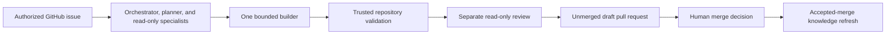

<div align="center">

# Agentify

**Turn authorized GitHub issues into validated draft pull requests with a persistent, repository-specific engineering team.**

[](https://github.com/anirudhsengar/agentify/actions/workflows/ci.yml)
[](https://nodejs.org/)
[](LICENSE)

[Getting started](#getting-started) · [How it works](#how-it-works) · [Security](#security-and-authority-boundaries) · [Documentation](#documentation)

</div>

Agentify is a Node.js CLI that installs a controlled multi-agent engineering workflow into an existing GitHub repository. You run the installer once; after that, authorized GitHub issues are the normal work interface.

For each queued task, Agentify plans with a persistent orchestrator, a read-only planner that refines the implementation steps, and evidence-backed read-only specialists, gives exactly one builder bounded write access on an isolated branch to inspect, edit, and self-check before its terminal submission, runs installer-attested unsandboxed validation, and obtains a role-separated automated read-only review before opening an **unmerged draft pull request**. A path-restricted knowledge maintainer refreshes learning after an accepted merge. The human retains merge authority; deployment is never automatic.

> [!NOTE]
> Agentify is an early public project. Its current evidence comes from maintainer-controlled qualification, security tests, and exact-artifact tests. This repository does not claim independent production adoption.

## At a glance

| Concern | Agentify's design |
| --- | --- |
| Installation | Run once in an existing repository |
| Work intake | Authorized GitHub issues with explicit scope and acceptance criteria |
| Planning | Persistent orchestrator, a read-only planner, plus evidence-backed read-only specialists |
| Source changes | Exactly one builder, one isolated task branch, bounded writable paths |
| Validation | Maintainer-approved repository commands run by trusted code |
| Review | Separate automated reviewer with no application-source write tools |
| Delivery | Unmerged draft pull request |
| Merge and deployment | Human-controlled; never automatic |
| Learning | Knowledge refresh from the exact accepted default-branch commit |

## How it works



1. A maintainer creates or approves an issue with testable acceptance criteria and explicit candidate paths.
2. Agentify verifies the actor, repository identity, issue state, and current default-branch commit.
3. The orchestrator builds a typed, evidence-backed plan; a read-only planner refines its implementation steps before selected repository specialists are consulted.
4. Exactly one builder receives bounded write authority on an isolated task branch and inspects, edits, and self-checks before its terminal submission.
5. Trusted code captures the diff and runs the approved repository validation outside the model process.
6. A role-separated, read-only reviewer evaluates the plan, diff, evidence, and acceptance criteria.
7. Successful work is published as an unmerged draft pull request.
8. After a human accepts and merges the change, Agentify refreshes only its allowlisted repository knowledge.

## Current repository support

Agentify targets repositories with this contract:

- an existing Git repository with at least one commit;
- a canonical `github.com` origin remote;
- GitHub CLI authentication with repository write, maintain, or admin access;
- a supported root build manifest with deterministic validation commands;
- a committed lockfile when the ecosystem requires one for reproducible dependency validation;
- tracked application source beneath a bounded repository path;
- credentials for a supported model provider.

Supported build manifests include:

| Ecosystem | Manifest | Typical validation | Lockfile (when required) |
| --- | --- | --- | --- |
| Node.js | `package.json` | `npm run test`, `typecheck`, or `lint` scripts | `package-lock.json`, `npm-shrinkwrap.json`, `pnpm-lock.yaml`, `yarn.lock`, or `bun.lock` |
| Python | `pyproject.toml`, `setup.py`, or `requirements.txt` | `pytest`, `ruff check`, or `mypy` (directly or via `Makefile`) | `uv.lock`, `poetry.lock`, or `Pipfile.lock` |
| Rust | `Cargo.toml` | `cargo test`, `cargo check` | `Cargo.lock` |
| Go | `go.mod` | `go test ./...`, `go vet ./...` | `go.sum` |
| Java (Maven) | `pom.xml` | `mvn -B test` | — |
| Java (Gradle) | `build.gradle` or `build.gradle.kts` | `./gradlew test` or `check` | `gradle.lockfile` (optional) |
| Ruby | `Gemfile` | `bundle exec rspec`, `rubocop` | `Gemfile.lock` |
| Make-based | `Makefile` | `make test`, `check`, `lint`, or `typecheck` targets | — |
| Shell | `build.sh`, `compile.sh`, `test.sh`, `lint.sh`, `get.sh`, `setup.sh`, etc. | `bash build.sh`, `bash test.sh`, etc. Install scripts (`get.sh`, `setup.sh`) are identified but not executed as validation | — |

Specialist-team installation and operational execution are separate capabilities.
A complete, grounded, validated team can install as `analysis-ready` when
repository-owned validation is not reproducible. Issue intake, PR publication,
autonomous mutation, and learning remain disabled: execution workflows and
runtimes are absent and the task policy is unconfigured. Generated instructions
record the blockers and evidence needed to enable execution by rerunning Agentify.
Agentify never creates a missing repository lockfile to obtain readiness.
Immutable external evaluation locks are harness artifacts, not repository
evidence or permission to enable execution.

### Local requirements

- Node.js 22.19.0 or newer
- npm
- Git
- [GitHub CLI](https://cli.github.com/) (`gh`), authenticated to the target repository
- Maintainer access to the target repository

## Getting started

### 1. Install and configure a model

```bash
npm install --global @anirudhsengar/agentify

cd /path/to/your/repository

# Run without arguments to pick a sign-in method interactively:
# subscription sign-ins (Claude Pro/Max, ChatGPT Plus/Pro, GitHub Copilot, …)
# are listed first, then "Sign in with an API key".
agentify login

# Or jump straight to a provider.
agentify login --provider anthropic
agentify models list --provider anthropic
# Replace <model-id> with a value returned by the previous command.
agentify models set "anthropic/<model-id>"
```

`agentify login` offers exactly the authentication methods the Pi model runtime supports for each provider: OAuth subscription sign-in where available (browser or device-code flow), otherwise an API key. Credentials are read from provider environment variables, the stored OAuth/API-key credentials from login, or a masked interactive prompt. They are never accepted as command-line values or written to the repository.

Before model exploration, Agentify seeds the audit map from immutable bytes at
the installer-preflight commit. This deterministically records repository
identity, languages and formats, tracked topography, verified test commands,
build metadata, and documentation metrics without trusting dirty working-tree
content. Semantic contracts and specialist concerns still require traced,
current-HEAD evidence; deterministic seeding cannot close them by inference.
Same-HEAD continuation maps retain their accumulated semantic evidence while
placeholder identity and empty topography are refreshed from the same immutable
preflight snapshot before any provider call.
Positive coverage citations must likewise name regular files tracked at exact
HEAD. Agentify-generated paths cannot establish repository facts, and absence
citations ignore dirty or generated working-tree bytes.

Audit resource limits are finite by default and may be raised for an unusually
large repository through the optional `auditBudgets` object in
`~/.agentify/config.json`. Omitted fields retain these defaults:

| Field | Default |
| --- | ---: |
| `maxTotalDurationMs` | 1,800,000 (30 minutes) |
| `maxSessionDurationMs` | 720,000 (12 minutes) |
| `maxScoutDurationMs` / `maxTracerDurationMs` | 180,000 each |
| `maxExplorerDurationMs` | 120,000 |
| `maxModelCalls` / `maxTurns` | 240 each |
| `maxInputTokens` / `maxOutputTokens` | 8,000,000 / 400,000 |
| `maxTotalCostUsd` | 20 (provider-reported) |
| `maxCoverageRecoveryPasses` / `maxSemanticRepairPasses` | 1 / 3 |
| `maxRepeatedFingerprintStates` | 2 |
| `maxExplorerSpawns` | 24 |

Overrides are strictly validated and remain subject to finite safety ceilings.
The output limit includes reported tokens, retained unanswered-request bounds,
and the next request's output reservation. Its 400,000-token default leaves
headroom for providers that cannot cap individual responses; a configured
smaller limit still rejects any request whose full bound would exceed it.
Parent audit requests and explorer sub-sessions consume the same aggregate call,
turn, token, cost, and elapsed-time budget. A tool-use continuation must leave
enough input capacity for another request at the just-observed context size.
Before every new parent or explorer session, Agentify reserves the selected
model's full context window so the SDK's initial request cannot cross the
remaining budget. Later requests are also checked against a conservative
serialized-payload upper bound; a same-HEAD restart cannot overshoot a nearly
exhausted checkpoint before provider usage is reported.
Diagnostic-only continuation at the same repository commit consumes the same
persisted aggregate usage; restarting the CLI does not reset the budget. A new
commit starts a new evidence lineage, while explicit overrides can raise the
finite limits for an unusually large repository without erasing prior usage.
Explorer work is serialized, and each mode has hard repository-read and
provider-call caps that are reduced to the aggregate calls still available. A
request is charged at dispatch admission, even if cancellation prevents a
response. Terminal logs distinguish invocation-local parent counters from
aggregate parent/explorer usage across the repository-commit lineage.
Unanswered calls are explicit and mark provider cost accounting incomplete;
missing provider usage must not be interpreted as a free request. A
request reserves its model's context-window input bound, enforced output ceiling
(or model maximum where the backend cannot cap output), and the corresponding
maximum metadata-priced cost before dispatch. Completed provider usage replaces
that request's reservation; interrupted or synthetic-zero responses retain it
across continuation. Logs separate measured usage from reserved upper bounds.
These bounds use configured model prices, not a provider invoice. Legacy
unanswered requests without reservations cannot authorize further paid calls.
A
complete report at the exact call limit is retained; a request for another turn
is aborted and remains unresolved. Budget failures name the current semantic
obligations and their deterministic fingerprint.
Model-supplied explorer limits may only narrow trusted mode defaults. Explorer
usage is charged to the aggregate budget after every provider response, and a
report over 16 KB is rejected as incomplete evidence rather than truncated into
a successful receipt. Concern tracers are additionally capped at six repository
reads and eight provider calls so one verbose trace cannot starve the rest of
an evidence-backed portfolio. A 12,000-token response ceiling leaves room for
configured reasoning; the stricter 16 KB final-report gate remains authoritative.
Scout proposals are application-attested obligations: each must be resolved by
a successful tracer or a substantive `not_concerns` rejection. Agentify
requires each tracer to call an application-owned typed submission tool, then
schema-validates and checkpoints the complete concern body before attesting the
receipt. A bounded retry on the same HEAD resumes verified work without parsing
free-form prose or asking the parent model to retranscribe it.
Nested append checkpoints retain earlier concern bodies and deduplicate exact
cumulative resends. Tool-result delivery is not counted as a provider call or
turn. `not_concerns` entries must actually reject their candidate; acceptance
wording cannot close an obligation. Fixed-point normalization removes an
append-only acceptance entry only when its candidate semantically matches an
accepted concern; unrelated malformed screening decisions remain unresolved.
Path-backed rejections may name exact tracked paths in a descriptive candidate
label, but do not exempt substring-related paths. Application timers enforce parent-session
deadlines, and an interrupted CLI rolls its pending installation back before
exiting. A later invocation may resume only the exact diagnostic-map-only
topology with a current-HEAD application receipt ledger; extra, stale, or
unattested state is never claimed. Each bounded continuation retains its newest
diagnostic checkpoint on failure, while operational installation state is
rolled back. Semantic, ownership, materialization, and structural failures restore
the exact prior state; a fresh failed run retains only its permitted diagnostic
map and no empty managed directories. Operational validation blockers alone may
retain the complete team as `analysis-ready`, with execution capabilities absent.
A successful tracer
is reusable only after its complete concern
body has also been checkpointed. Concern checkpoints append and deduplicate by
default so later bounded invocations cannot erase earlier tracer evidence.
The parent receives a short typed-report acknowledgement and bounded compiler
obligations; the complete concern stays in application-owned checkpoint data,
without duplicating every flow and invariant in subsequent model requests.
On attach, recorded concern evidence is deterministically compiled before any
model-backed top-up audit; a normalizable fixed point can therefore finish
without spending or resetting an exhausted model budget when its exact
normalized bodies already have current-HEAD narrative reviews. Changed bodies
require fresh review with the configured primary model: one request per concern,
90 seconds and at most 256 KiB of immutable source. A typed, complete review is
required; unsupported assertions and incomplete reviews remain repair obligations.
Incomplete reviews may retry once in a later bounded run; an unchanged source-backed
finding remains cached until the specialist body or repository HEAD changes.
This quality control does not replace manual release qualification.
Agentify-managed paths observed during the transaction are normalized out of
repository topography and process evidence before the map can close.
The explorer runtime permits only one successful concern scout per repository
commit; resumed and repair sessions reuse its attested proposal set.
Up to three independent read-only explorers can overlap under the shared resource
reservation budget; duplicate active scouts and concern identities are refused.
All explorer modes request at most 12,000 response tokens where the provider API
supports a cap. Uncappable APIs retain their full model-limit reservation.
Each tracer dispatch binds one exact concern identity before model entry;
renamed typed reports are rejected instead of creating duplicate specialists or
silently satisfying a different scout proposal.
Before tracing, candidates with the same sole tracked implementation file and
no independent implementation owner are grouped into the broader behavioral
concern. Ordinary shared supporting touchpoints remain overlap rather than a
merge signal, and tracers prefer concern-specific implementation files as core.
Semantic closure requires exactly one accepted core owner for each tracked
file. Adjacent specialists may share it only as a supporting touchpoint until
the portfolio resolves ownership. Normalization resolves a shared
implementation file without another model call only when exactly one concern
would otherwise lose all core ownership and every adjacent concern retains an
independent core path. It also promotes one supporting implementation path when
that path is cited by exactly one accepted concern whose prior core evidence is
test-only; tied implementation candidates remain unresolved. A mirrored implementation/test cluster is assigned only
when one accepted concern explicitly cites the complete pair and every competing
concern cites a strict subset. Ambiguous shared files and tied cluster claims
remain unresolved. An example- or fixture-only candidate is rejected as an
independent specialist when at least two portfolio-distinct behavioral tokens
overlap a concern with independent implementation core. The rejection retains
its exact tracked paths; an unrelated example product and a repository whose
product is tests remain eligible.
An observed public type trace can assign a declaration file only when its named
type resolves to one tracked declaration path and every traced runtime file
resolves to the same normalized core owner. The declaration becomes that
specialist's core public surface; competing runtime owners remain unresolved.
Exclusions block deterministic attachment only when they match at least two
behavioral tokens, or one token that is not already part of the concern's
positive evidence. A generic shared word cannot veto an otherwise exact local
implementation/test mirror.
When one supporting claimant lacks an independent core implementation and every
current core owner of the shared orchestration file retains another independent
implementation core, normalization assigns the shared file to that sole
dependent claimant. Multiple dependent claimants remain unresolved.
When core claimants cite concrete symbols in the same shared file, normalization
may instead choose the sole claimant whose symbol set is a strict superset of
every competitor. Empty, disjoint, equal, or incomparable symbol claims remain
unresolved.

### 2. Run the one-time installer

```bash
agentify
```

The installer:

- verifies the repository root, tracked contribution/agent policies, GitHub identity, maintainer authority, and default-branch policy; an explicit ban on AI/LLM-authored repository work stops before any Agentify write;
- discovers validation commands, screens them for obvious production credentials and mutation, provisions lock-bound dependencies in a disposable checkout (with Node lifecycle scripts disabled), then executes validation against the exact committed HEAD; post-install checks repeat provisioning and overlay only Agentify-managed output, while network and OS execution remain explicitly unsandboxed;
- when the repository root has only build or syntax checks, considers up to 64 tracked nested manifests within four directories and prefers a real required test suite while retaining root ecosystem precedence on ties; fully pinned pip requirements with SHA-256 hashes count as a lock, and Python projects with tracked tests but no pytest contract use standard-library unittest discovery unless its tracked import graph reaches a network client, in which case a tracked offline module is eligible only when the README documents individual-unittest execution;
- audits the repository and creates persistent specialists, procedures, and knowledge;
- refines missing validation from the audited validation surface when discovery did not verify a required command;
- installs the issue and accepted-merge learning workflows;
- writes a repository-bound task policy containing validation and lockfile hashes;
- configures required labels and non-secret repository variables;
- with interactive consent, uploads the stored provider credentials (API keys and OAuth subscription sign-ins) to the `PI_AUTH_JSON` Actions secret, or copies a resolved environment API key to `PI_API_KEY`;
- runs deterministic installation canaries and enables issue intake only when all checks pass.

The CLI is an installer and maintenance interface. Do not rerun it for ordinary tasks; use GitHub issues after installation.

### 3. Configure workflow credentials

The installer can configure these GitHub Actions secrets:

- **`PI_AUTH_JSON`** — the stored provider credentials used by the installed workflows, covering both API keys and OAuth subscription sign-ins created by `agentify login`. Set only after interactive consent; the payload passes through `gh secret set` stdin. To configure manually: `gh secret set PI_AUTH_JSON < ~/.agentify/auth.json`.
- **`PI_API_KEY`** — fallback for environment-only API-key setups with no stored credential. When a local provider key is resolved from the environment, the installer copies it through `gh secret set` stdin; otherwise it prompts interactively, or prints `gh secret set` guidance when no TTY is available.
- **`AGENT_PAT`** — optional but recommended; used only by trusted workflow code to push the task branch, publish its draft pull request, and write rotated OAuth credentials back to `PI_AUTH_JSON`. A dedicated token allows the resulting pull request to trigger the repository's normal pull-request workflows, and lets OAuth subscription credentials survive provider-side refresh-token rotation. This secret is set only after interactive consent.

When an OAuth access token expires during a run, the trusted runtime refreshes it under lock and persists the rotated credential back to `PI_AUTH_JSON` at the end of the run through `AGENT_PAT`. Without that write-back, the next run would authenticate with an invalidated refresh token.

A fine-grained `AGENT_PAT` needs access only to the target repository with:

- **Contents:** read and write
- **Pull requests:** read and write
- **Secrets:** read and write

No credential is exposed to model processes.

## Queue your first task

Create a GitHub issue using this minimum structure:

```markdown
## Goal
Describe the requested outcome.

## Acceptance criteria
- [ ] State one testable result per item.

## Scope
- `src/example.ts`

## Out of scope
- `.github/`
- `package.json`
```

Then add the **`agentify:queue`** label.

> [!IMPORTANT]
> The paths in `## Scope` are an authority boundary, not just planning hints. Include every application path the builder may need to change.

Trusted maintainers can control an active task with these exact issue comments:

```text
/agent approve
/agent stop
/agent retry
/agent replan
/agent explain
```

## What gets installed

The exact contents vary with repository analysis, but the managed footprint is approximately:

```text
AGENTS.md                              # Repository instructions for coding agents
SETUP.md                               # Maintainer usage and credential guidance

.agentify/
├── manifest.json                      # Repository and state identity
├── agents/                            # Persistent team and specialist definitions
├── knowledge/                         # Provenance-bound repository knowledge
├── policies/                          # Execution and protected-path policy
└── runtime/                           # Audit/runtime state

.github/
├── agentify-task-policy.json          # Repository-bound task and validation policy
├── agentify/
│   ├── task-runtime.mjs               # Bundled trusted task runtime
│   └── learning-runtime.mjs           # Bundled trusted learning runtime
├── scripts/
│   ├── complete-accepted-task-merge.mjs
│   ├── publish-task-draft.mjs
│   ├── run-task-lifecycle.mjs
│   └── task-state-github.mjs
└── workflows/
    ├── agentify-issue.yml              # Authorized issue execution
    └── agentify-learn.yml              # Accepted-merge learning
```

Agentify preserves user-owned files. If a required path is already occupied by unrecognized content, the installer leaves it untouched, writes or reports the managed alternative, and fails closed until the conflict is resolved.

## Security and authority boundaries

> [!WARNING]
> Repository validation executes installer-attested, repository-owned code **without OS-level sandboxing or network isolation**. Agentify removes common credential variables, rejects visible deployment and publication commands, detects repository mutation, and binds attestation to the manifest, commands, and lockfile—but these controls are guardrails, not process isolation.

| Boundary | Enforced behavior |
| --- | --- |
| GitHub credentials | Model processes never receive GitHub write credentials |
| Read-only roles | Audit, specialist, orchestrator, planner, reviewer, and knowledge-maintainer sessions cannot edit application source |
| Application writer | Exactly one builder may edit only approved paths on the isolated task branch |
| Trusted mutations | Trusted code validates typed output, repository identity, commits, branches, paths, state transitions, validation, and review evidence |
| Validation approval | The approved manifest, command set, and lockfile are hashed; drift disables issue intake until renewed consent |
| Pull requests | Agentify publishes draft pull requests only |
| Merge and deployment | Never performed automatically |
| Learning | May update only validated Agentify knowledge paths after an exact accepted merge |

Automated review is role-separated and read-only, but it is not a substitute for human peer review. See [SECURITY.md](SECURITY.md) for the complete boundary and vulnerability-reporting process.

## Verification

The release gate builds the executable bundles, runs source and scaffold tests, installs and exercises the exact npm tarball, checks CLI parity, and audits production dependencies.

```bash
npm run verify:release
```

Useful evidence:

- [CI workflow](https://github.com/anirudhsengar/agentify/blob/main/.github/workflows/ci.yml)
- [Exact installed-artifact qualification](https://github.com/anirudhsengar/agentify/blob/main/tests/package/exact-artifact-qualification.mjs)
- [Release process](docs/release-process.md)
- [Product and trust contract](docs/architecture/install-once-repository-team.md)
- [Security boundary](SECURITY.md)

## CLI reference

```text
agentify
agentify --help
agentify --version

agentify login [--provider <name>]
agentify logout [--provider <name> | --all] [--yes]

agentify models list [--provider <name>]
agentify models show [--resolved]
agentify models set <provider>/<model>
agentify models set <primary|explorer|lite> <provider>/<model>
agentify models unset [primary|explorer|lite]
```

`primary` is the default model assignment. `explorer` and `lite` inherit `primary` unless configured explicitly.

## Development

```bash
git clone https://github.com/anirudhsengar/agentify.git
cd agentify
npm ci

npm run typecheck
npm run test:all
npm run verify:release
```

Agentify is an ESM-only, strict-TypeScript project. See [CONTRIBUTING.md](CONTRIBUTING.md) for the source layout, implementation rules, security requirements, and pull-request expectations.

## Documentation

| Topic | Document |
| --- | --- |
| Product and trust contract | [Install-once repository engineering team](docs/architecture/install-once-repository-team.md) |
| System architecture | [Architecture](docs/architecture.md) |
| Authorized issue lifecycle | [Issue lifecycle](docs/architecture/issue-lifecycle.md) |
| Persistent memory | [Agent memory](docs/architecture/agent-memory.md) |
| Repository specialists | [Repository specialists](docs/architecture/repository-specialists.md) |
| Accepted-merge learning | [Continuous learning](docs/architecture/continuous-learning.md) |
| Runtime state and recovery | [State lifecycle](docs/state-lifecycle.md) |
| Build and packaging | [Build and package](docs/build-and-package.md) |
| Release procedure | [Release process](docs/release-process.md) |
| Security | [Security policy](SECURITY.md) |

See the complete [documentation index](docs/README.md).

## Contributing

Contributions are welcome. Start with [CONTRIBUTING.md](CONTRIBUTING.md), keep changes small and reviewable, and include the verification you performed.

## License

Agentify is available under the [MIT License](LICENSE).
