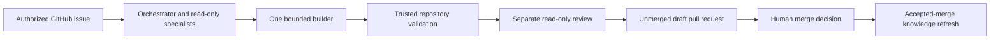

<div align="center">

# Agentify

**Turn authorized GitHub issues into validated draft pull requests with a persistent, repository-specific engineering team.**

[](https://github.com/anirudhsengar/agentify/actions/workflows/ci.yml)
[](https://nodejs.org/)
[](LICENSE)

[Getting started](#getting-started) · [How it works](#how-it-works) · [Security](#security-and-authority-boundaries) · [Documentation](#documentation)

</div>

Agentify is a Node.js CLI that installs a controlled multi-agent engineering workflow into an existing GitHub repository. You run the installer once; after that, authorized GitHub issues are the normal work interface.

For each queued task, Agentify plans with a persistent orchestrator and evidence-backed read-only specialists, gives exactly one builder bounded write access on an isolated branch, runs maintainer-approved validation, and obtains a role-separated automated read-only review before opening an **unmerged draft pull request**. A path-restricted knowledge maintainer refreshes learning after an accepted merge. The human retains merge authority; deployment is never automatic.

> [!NOTE]
> Agentify is an early public project. Its current evidence comes from maintainer-controlled qualification, security tests, and exact-artifact tests. This repository does not claim independent production adoption.

## At a glance

| Concern | Agentify's design |
| --- | --- |
| Installation | Run once in an existing repository |
| Work intake | Authorized GitHub issues with explicit scope and acceptance criteria |
| Planning | Persistent orchestrator plus evidence-backed read-only specialists |
| Source changes | Exactly one builder, one isolated task branch, bounded writable paths |
| Validation | Maintainer-approved repository commands run by trusted code |
| Review | Separate automated reviewer with no application-source write tools |
| Delivery | Unmerged draft pull request |
| Merge and deployment | Human-controlled; never automatic |
| Learning | Knowledge refresh from the exact accepted default-branch commit |

## How it works



1. A maintainer creates or approves an issue with testable acceptance criteria and explicit candidate paths.
2. Agentify verifies the actor, repository identity, issue state, and current default-branch commit.
3. The orchestrator builds a typed, evidence-backed plan with selected repository specialists.
4. Exactly one builder receives bounded write authority on an isolated task branch.
5. Trusted code captures the diff and runs the approved repository validation outside the model process.
6. A role-separated, read-only reviewer evaluates the plan, diff, evidence, and acceptance criteria.
7. Successful work is published as an unmerged draft pull request.
8. After a human accepts and merges the change, Agentify refreshes only its allowlisted repository knowledge.

## Current repository support

Agentify currently targets repositories with this contract:

- an existing Git repository with at least one commit;
- a canonical `github.com` origin remote;
- GitHub CLI authentication with repository write, maintain, or admin access;
- a root `package.json`;
- at least one deterministic root script named `test`, `test:all`, `check`, `typecheck`, `type-check`, or `lint`;
- `package-lock.json` or `npm-shrinkwrap.json` when package dependencies are declared;
- tracked application source beneath a bounded repository path;
- credentials for a supported model provider.

Agentify may analyze a repository that is not ready for issue execution, but it keeps issue intake disabled until every readiness blocker is resolved.

### Local requirements

- Node.js 22.19.0 or newer
- npm
- Git
- [GitHub CLI](https://cli.github.com/) (`gh`), authenticated to the target repository
- Maintainer access to the target repository

## Getting started

### 1. Install and configure a model

```bash
npm install --global @anirudhsengar/agentify

cd /path/to/your/repository

# Anthropic is an example; choose a provider supported by your environment.
agentify login --provider anthropic
agentify models list --provider anthropic
# Replace <model-id> with a value returned by the previous command.
agentify models set "anthropic/<model-id>"
```

Provider credentials are read from provider environment variables, supported OAuth instructions, or a masked interactive prompt. They are never accepted as command-line values or written to the repository.

### 2. Run the one-time installer

```bash
agentify
```

The installer:

- verifies the repository root, GitHub identity, maintainer authority, and default-branch policy;
- discovers the exact validation commands without running them;
- displays those commands and requires explicit interactive approval before first execution;
- audits the repository and creates persistent specialists, procedures, and knowledge;
- installs the issue and accepted-merge learning workflows;
- writes a repository-bound task policy containing validation and lockfile hashes;
- configures required labels and non-secret repository variables;
- runs deterministic installation canaries and enables issue intake only when all checks pass.

The CLI is an installer and maintenance interface. Do not rerun it for ordinary tasks; use GitHub issues after installation.

### 3. Configure workflow credentials

The installer can configure these GitHub Actions secrets with explicit consent:

- **`PI_API_KEY`** — the model-provider credential used by the installed workflows.
- **`AGENT_PAT`** — optional but recommended; used only by trusted workflow code to push the task branch and publish its draft pull request. A dedicated token allows the resulting pull request to trigger the repository's normal pull-request workflows.

A fine-grained `AGENT_PAT` needs access only to the target repository with:

- **Contents:** read and write
- **Pull requests:** read and write

Neither credential is exposed to model processes.

## Queue your first task

Create a GitHub issue using this minimum structure:

```markdown
## Goal
Describe the requested outcome.

## Acceptance criteria
- [ ] State one testable result per item.

## Scope
- `src/example.ts`

## Out of scope
- `.github/`
- `package.json`
```

Then add the **`agentify:queue`** label.

> [!IMPORTANT]
> The paths in `## Scope` are an authority boundary, not just planning hints. Include every application path the builder may need to change.

Trusted maintainers can control an active task with these exact issue comments:

```text
/agent approve
/agent stop
/agent retry
/agent replan
/agent explain
```

## What gets installed

The exact contents vary with repository analysis, but the managed footprint is approximately:

```text
AGENTS.md                              # Repository instructions for coding agents
SETUP.md                               # Maintainer usage and credential guidance

.agentify/
├── manifest.json                      # Repository and state identity
├── agents/                            # Persistent team and specialist definitions
├── knowledge/                         # Provenance-bound repository knowledge
├── policies/                          # Execution and protected-path policy
└── runtime/                           # Audit/runtime state

.github/
├── agentify-task-policy.json          # Repository-bound task and validation policy
├── agentify/
│   ├── task-runtime.mjs               # Bundled trusted task runtime
│   └── learning-runtime.mjs           # Bundled trusted learning runtime
├── scripts/
│   ├── complete-accepted-task-merge.mjs
│   ├── publish-task-draft.mjs
│   ├── run-task-lifecycle.mjs
│   └── task-state-github.mjs
└── workflows/
    ├── agentify-issue.yml              # Authorized issue execution
    └── agentify-learn.yml              # Accepted-merge learning
```

Agentify preserves user-owned files. If a required path is already occupied by unrecognized content, the installer leaves it untouched, writes or reports the managed alternative, and fails closed until the conflict is resolved.

## Security and authority boundaries

> [!WARNING]
> Repository validation executes maintainer-approved, repository-owned code **without OS-level sandboxing or network isolation**. Agentify removes common credential variables, rejects visible deployment and publication commands, detects repository mutation, and binds approval to the manifest, commands, and lockfile—but these controls are guardrails, not process isolation.

| Boundary | Enforced behavior |
| --- | --- |
| GitHub credentials | Model processes never receive GitHub write credentials |
| Read-only roles | Audit, specialist, orchestrator, reviewer, and knowledge-maintainer sessions cannot edit application source |
| Application writer | Exactly one builder may edit only approved paths on the isolated task branch |
| Trusted mutations | Trusted code validates typed output, repository identity, commits, branches, paths, state transitions, validation, and review evidence |
| Validation approval | The approved manifest, command set, and lockfile are hashed; drift disables issue intake until renewed consent |
| Pull requests | Agentify publishes draft pull requests only |
| Merge and deployment | Never performed automatically |
| Learning | May update only validated Agentify knowledge paths after an exact accepted merge |

Automated review is role-separated and read-only, but it is not a substitute for human peer review. See [SECURITY.md](SECURITY.md) for the complete boundary and vulnerability-reporting process.

## Verification

The release gate builds the executable bundles, runs source and scaffold tests, installs and exercises the exact npm tarball, checks CLI parity, and audits production dependencies.

```bash
npm run verify:release
```

Useful evidence:

- [CI workflow](https://github.com/anirudhsengar/agentify/blob/main/.github/workflows/ci.yml)
- [Exact installed-artifact qualification](https://github.com/anirudhsengar/agentify/blob/main/tests/package/exact-artifact-qualification.mjs)
- [Release process](docs/release-process.md)
- [Product and trust contract](docs/architecture/install-once-repository-team.md)
- [Security boundary](SECURITY.md)

## CLI reference

```text
agentify
agentify --help
agentify --version

agentify login [--provider <name>]
agentify logout [--provider <name> | --all] [--yes]

agentify models list [--provider <name>]
agentify models show [--resolved]
agentify models set <provider>/<model>
agentify models set <primary|explorer|lite> <provider>/<model>
agentify models unset [primary|explorer|lite]
```

`primary` is the default model assignment. `explorer` and `lite` inherit `primary` unless configured explicitly.

## Development

```bash
git clone https://github.com/anirudhsengar/agentify.git
cd agentify
npm ci

npm run typecheck
npm run test:all
npm run verify:release
```

Agentify is an ESM-only, strict-TypeScript project. See [CONTRIBUTING.md](CONTRIBUTING.md) for the source layout, implementation rules, security requirements, and pull-request expectations.

## Documentation

| Topic | Document |
| --- | --- |
| Product and trust contract | [Install-once repository engineering team](docs/architecture/install-once-repository-team.md) |
| System architecture | [Architecture](docs/architecture.md) |
| Authorized issue lifecycle | [Issue lifecycle](docs/architecture/issue-lifecycle.md) |
| Persistent memory | [Agent memory](docs/architecture/agent-memory.md) |
| Repository specialists | [Repository specialists](docs/architecture/repository-specialists.md) |
| Accepted-merge learning | [Continuous learning](docs/architecture/continuous-learning.md) |
| Runtime state and recovery | [State lifecycle](docs/state-lifecycle.md) |
| Build and packaging | [Build and package](docs/build-and-package.md) |
| Release procedure | [Release process](docs/release-process.md) |
| Security | [Security policy](SECURITY.md) |

See the complete [documentation index](docs/README.md).

## Contributing

Contributions are welcome. Start with [CONTRIBUTING.md](CONTRIBUTING.md), keep changes small and reviewable, and include the verification you performed.

## License

Agentify is available under the [MIT License](LICENSE).
