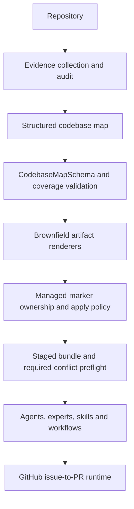

# Generation architecture and trust boundary

Repository understanding is the probabilistic boundary: a model may collect and
synthesize evidence, but its output is only an input proposal. The codebase-map
schema and coverage-quality gate are deterministic and reject malformed or
incomplete proposals before repository-facing artifacts are rendered.

Rendering is deterministic for a given validated map. The apply layer enforces
ownership using Agentify's managed markers and the configured conflict policy;
it never relies on the model to identify user-owned files. Required conflicts
are preflighted before bundle writes, and the manifest records sorted paths and
content hashes. Each successful run retains its own run ID and timestamp, so
tests treat those two manifest fields as intentionally volatile. Repository safety therefore remains enforced in code even when
model-assisted understanding is incomplete or wrong.
