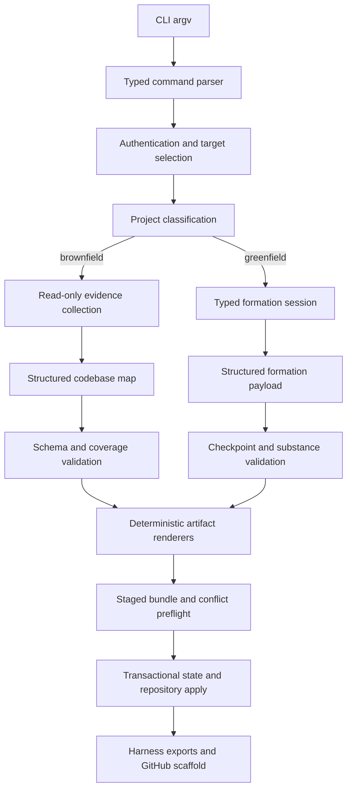

# Generation architecture and trust boundary

Agentify has one supported public runtime surface: the installed `agentify`
command. Its internal architecture separates probabilistic repository
understanding from deterministic validation, rendering, ownership, and apply
logic.

## End-to-end flow

Repository understanding is the probabilistic boundary. A model may collect and
synthesize evidence, but its output is only an input proposal. TypeBox schemas,
coverage gates, checkpoint validation, renderers, ownership checks, and apply
logic are deterministic.

## Runtime layers

| Layer | Responsibilities | Trust posture |
| --- | --- | --- |
| CLI | Parse options and utility subcommands; select the application path | Untrusted input, strict parser |
| Configuration | Resolve provider credentials, model slots, and targets | Secrets remain outside repository state |
| Model runtime | Run builder, explorer, review, or workflow sessions | Explicit execution policy required |
| Structured tools | Accept typed maps and formation payloads | Schema-validated, application-owned tools |
| Renderers | Produce managed artifacts from validated state | Deterministic |
| Apply | Preflight conflicts, protect user files, stage and commit changes | Deterministic and rollback-capable |
| Exporters | Fan out selected harness surfaces | Registry-driven, managed-marker ownership |
| GitHub scaffold | Install the asynchronous issue/comment/PR runtime | Credential-free planning plus scoped action secrets |

## Capability security

Every model-backed session receives an execution policy defining:

- allowed built-in and trusted custom tools;
- readable and writable roots;
- protected paths;
- shell permission;
- network posture;
- runtime and output limits.

Brownfield builders and explorers are read-only. Filesystem reads are confined
by both lexical and symlink-resolved containment. Structured custom tools such
as `write_map` write only application-owned state and do not grant general file
write capability. Security does not depend on a prompt or mutable global audit
flag.

See `SECURITY.md` and `docs/webhook-security.md` for threat-specific controls.

## State transaction

Provider-scoped state lives under `.claude/agentify`, `.agents/agentify`, or
`.pi/agentify`. A run does not delete valid state before replacement.

The transaction lifecycle is:

1. recover any interrupted prior transaction;
2. move existing state to a run-specific backup;
3. create and journal the destination state;
4. validate generated state and staged repository artifacts;
5. apply repository changes;
6. write a durable committed phase;
7. remove the backup and journal.

Any pre-commit failure restores the complete prior tree. Recovery treats a
durable committed phase as successful even when cleanup was interrupted.

## Artifact ownership and rollback

Rendering is deterministic for a given validated map. Managed markers and the
manifest identify Agentify-owned files; pre-existing user-owned files are never
silently overwritten. Required conflicts are detected before bundle writes.

The manifest records sorted paths, hashes, state directory, and run metadata.
Run ID and timestamp are intentionally volatile; artifact content and ownership
are not.

## Shared artifact primitives

Dependency-neutral modules under `src/core/artifacts/` own managed-marker
formatting, reserved feature-agent conventions, generated-surface paths, and
artifact path normalization. Exporters and renderers consume these primitives;
compatibility exports preserve older internal import locations without making
them new package APIs. Package-version reading is similarly centralized in
`src/core/package-version.ts`.

## Deterministic renderer ownership

The stable `src/core/artifacts/renderers.ts` import path is a compatibility façade.
Pure renderer families live under `src/core/artifacts/renderers/`: artifact builders
and validation-command helpers provide shared formatting; dedicated modules own the
agent guide, always-on docs, feedback-loop docs, workflows, feature agents, prompt
templates and lifecycle prompts, experts, and skills/extensions. `index.ts` owns
schema/coverage validation, family composition order, unsafe-path checks, duplicate
checks, and the legacy façade exports. Renderer modules perform no filesystem I/O.

## Audit schema contract and algorithm ownership

`src/core/audit/schema.ts` remains the sole owner of the codebase-map, partial-map,
and write-map TypeBox declarations. Their required fields, optionality, enums,
bounds, descriptions, and serialized forms remain contract data. The same module
continues to re-export the established helper names for compatibility.

Non-schema behavior has focused owners:

- `coverage.ts` owns the canonical coverage dimensions, summary calculation,
  substance gates, closure ordering, constants, and stable reason text;
- `map-defaults.ts` owns shallow-copy default injection and preserves the
  `schema_version` then `generated_at` application order; and
- `schema-compatibility.ts` owns deterministic interpretation of documented
  typed-versus-legacy aliases without declaring schemas.

The extracted modules use schema-derived types only and do not initialize or
redefine TypeBox declarations. Golden schema fingerprints and behavior tables
protect the compatibility façade against contract drift.

## Structured write-map ownership

The stable `src/core/audit/write-map-tool.ts` path is a compatibility façade for
the application-owned `write_map` and `write_map_delta` trust boundary. Internal
responsibilities are separated as follows:

- `map-storage.ts` owns provider-scoped canonical, draft, and history paths,
  canonical persistence, atomic draft transport, legacy fallback reads, and
  per-factory execution context;
- `map-input.ts` owns relative and absolute input resolution, byte caps, BOM
  handling, JSON parsing, and stable file-read error translation;
- `map-validation.ts` owns complete and partial TypeBox validation plus stable
  validation-error formatting, while `schema.ts` remains the TypeBox schema
  source of truth and re-exports defaults from `map-defaults.ts`;
- `map-coverage.ts` formats coverage closure, reasons, summaries, and warnings
  from the coverage-owned closure assessment re-exported by `schema.ts`;
- `map-delta.ts` owns the existing shallow-overwrite, deep-merge, and append
  semantics;
- `map-observability.ts` owns per-dimension retry counters and soft-ceiling
  guidance without imposing a hard cap;
- `write-map-tools.ts` owns the factory-created tool definitions and exact
  model-visible protocol; and
- `legacy-write-map.ts` owns deprecated constants and wrappers preserving
  historical direct-call behavior.

The façade re-exports the same functions, types, constants, singleton tools, and
factory API. Storage, validation, coverage, and tool modules do not redefine the
audit TypeBox schemas or expand the package surface.

## Generation pipeline ownership

Repository-facing generation primitives live under `src/core/generation/`.
`artifact-snapshot.ts` owns generated-surface snapshots and rollback;
`staging-bundle.ts` owns temporary bundle construction and metadata;
`apply-bundle.ts` owns conflict preflight, symlink protection, apply policy,
and manifest assembly; `apply-report.ts` owns deterministic report text; and
`session-agent-snapshot.ts` owns temporary feature-agent capture and mirroring.
`run-agentify.ts` coordinates these modules and retains compatibility re-exports
for the previously imported generation helpers.

## Run orchestration ownership

`run-agentify.ts` remains the stable coordinator for configuration resolution,
project classification, ambiguous-mode selection, and delegation. Shared typed
inputs and the generated-surface snapshot contract live in
`src/core/runs/run-context.ts`.

Brownfield and greenfield remain explicit state machines rather than a generic
workflow framework. `brownfield-run.ts` owns the audit transaction, logging,
model session, rendering, staging, apply, rollback, and commit sequence.
`greenfield-run.ts` owns formation execution, deterministic rendering,
substance validation, staging, apply, and greenfield-state persistence.
`project-state-reporter.ts` owns GitHub readiness output and project-state JSON
writes shared by both modes. Their meaningful lifecycle differences remain
visible in the two functions.

## State-directory ownership

A supported brownfield run resolves its provider-scoped state directory once.
It then creates a fresh `createWriteMapTools({ stateDir })` result and passes an
explicit `RenderContext` to deterministic rendering. The tool factory captures
canonical-map, history, and draft-layout information for that run; asynchronous
tool execution is isolated from other in-process factories. Renderer helpers
receive the same run-owned state directory through function arguments.

Production orchestration does not call `setMapSessionStateDir` or
`setRendererStateDir`. Those setters, singleton map tools, and legacy path
constants remain deprecated compatibility adapters for older direct callers and
tests. Legacy map fallback precedence is unchanged. Factory-bound draft
transport reads and writes only under the configured provider state directory;
the deprecated singleton retains the historical Pi draft path.

## Module categories and dependency direction

The post-refactor source tree is divided into three dependency categories:

- **Supported product path:** `src/cli.ts`, CLI parsing and utility commands,
  `agentify-app.ts`, brownfield and greenfield run modules, audit schemas and
  validation, deterministic renderers, generation/apply, ownership, state,
  configuration, and build/package support reachable from the installed command.
- **Neutral shared infrastructure:** stable internal contracts and primitives that
  may be consumed by supported and experimental code. The current shared set
  includes core types, configuration, model resolution, Pi runtime integration,
  execution-policy and audit-defense primitives. `orchestrator/workflow-spec.ts`
  is an intentional neutral exception inside an otherwise experimental directory;
  its declarative workflow JSON assets are copied to `dist/workflows/` for the
  supported deterministic renderer.
- **Experimental composition and runtime:** webhook, AIW, the orchestrator runtime
  and its owned communications transport, Agent Expert, and maintainer-only expert
  outcome/qualification modules. Their tests do not make them supported APIs.

Allowed dependency direction is explicit: supported modules may depend only on
other supported modules or neutral infrastructure; neutral modules must not
depend on experimental composition roots; experimental modules may consume
neutral or supported low-level contracts. The supported CLI graph must never
reach an experimental runtime. Package exports, build asset copies, command
registration, tarball contents, and public documentation are checked alongside
the source import graph by `tests/maintenance/module-boundaries.test.ts`.

Adding a new neutral exception requires an architecture review and a matching
maintenance-test update. Moving a runtime out of the experimental category
requires the graduation process in `docs/experimental-surfaces.md`; a source
import, build copy, or documentation example cannot perform that graduation.

## Orchestrator communications ownership

The orchestrator owns its local peer transport under
`src/core/orchestrator/comms/`. `src/core/orchestrator/worker.ts` is the only
production source consumer outside the transport modules themselves. Relocating
the source changes no protocol bytes, envelope fields, error codes, hop limits,
timeout defaults, registry records, socket locations, or operator state under
`~/.pi/coms`.

The transport remains local Unix-domain-socket infrastructure for the experimental
orchestrator. It does not grant repository capabilities, add a network listener,
create a package export, or graduate the orchestrator into the supported product
surface.

## Webhook boundary

Webhook intake verifies body size and HMAC before consuming authenticated
trigger quotas. Optional delivery IDs and signature digests provide replay
protection. External payloads cannot choose working directories, tool lists,
write roots, credentials, or command policy. Public task status is redacted,
and management reload is disabled unless explicitly enabled on loopback with an
administrator token.

Webhook, AIW, orchestrator (including its communications transport), and Agent
Expert code remain internal experimental modules. Their source presence does not
make them package APIs. See `docs/experimental-surfaces.md`.

## Build and release boundary

TypeScript source is bundled into `dist/cli.js`; required prompt and workflow
assets are copied explicitly. The npm artifact excludes raw source and exposes
only the command. CI verifies both supported Node versions, production
dependencies, the packed tarball, and CodeQL. Tag publication requires the tag
to match `package.json`, and npm receives the exact artifact that passed smoke
testing.

See `docs/build-and-package.md` and `docs/release-process.md`.
