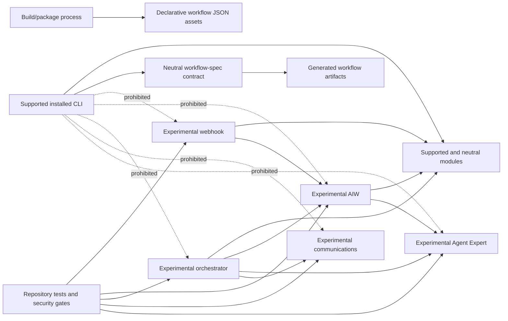
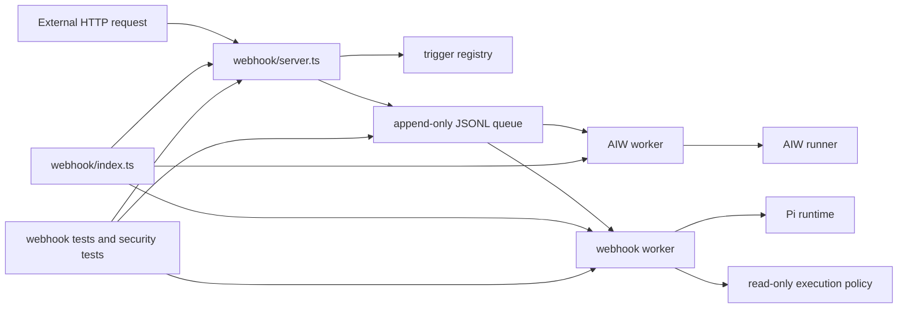
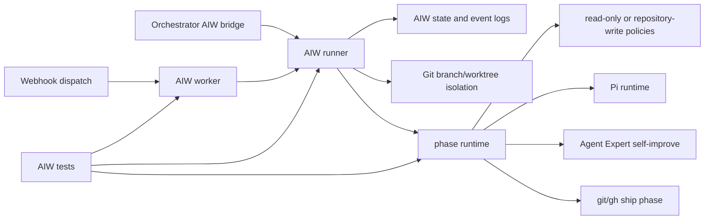
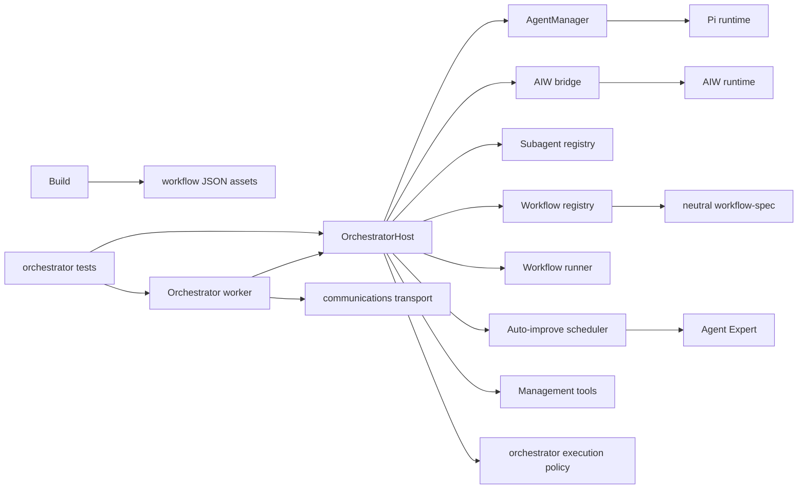
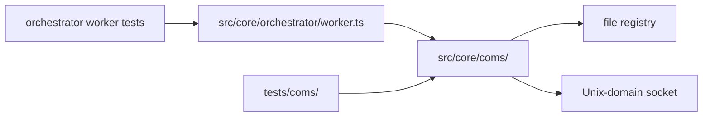
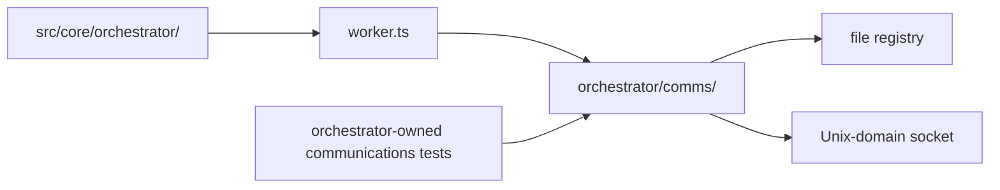
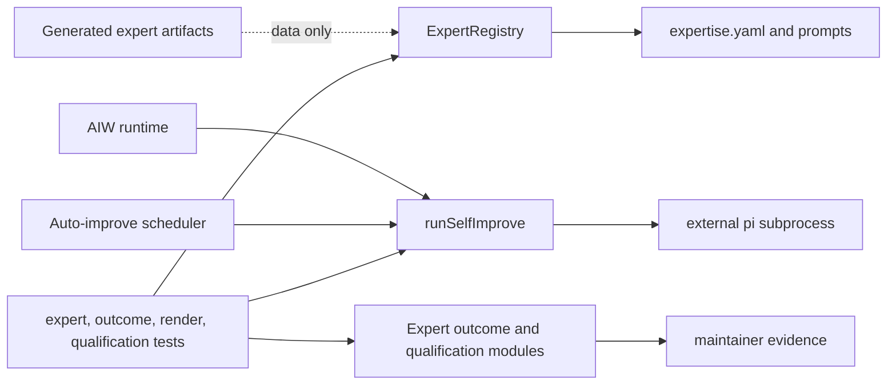

# Experimental runtime lifecycle decisions

Status: accepted architecture decision for Issue #35  
Decision date: 2026-07-12  
Scope: repository-internal webhook, AIW, orchestrator, communications, and Agent Expert runtime code

## Executive decision

Agentify continues to expose one supported public runtime: the installed `agentify` command. Repository test coverage, implementation maturity, or source availability does not independently create a supported product contract.

| Subsystem | Decision | Ownership after this decision | Follow-up |
| --- | --- | --- | --- |
| Webhook | **Retain internal in place** | `src/core/webhook/` | None. Revisit only after an operator/product proposal exists. |
| AIW | **Retain internal in place** | `src/core/aiw/` | None. Revisit only after execution, shipping, and support policy are productized. |
| Orchestrator | **Retain internal in place** | `src/core/orchestrator/` | None. Preserve the neutral workflow-contract exception. |
| Communications | **Relocate internally** | Move from `src/core/coms/` beneath the orchestrator experimental boundary | Issue #48. No move occurs in this decision PR. |
| Agent Expert | **Retain internal in place** | `src/core/agent-expert.ts` and the related internal evidence modules | None. Resolve runtime-contract gaps before any graduation proposal. |

No subsystem is approved for graduation, archive, or removal. Communications relocation is the only approved implementation action because its source graph shows one runtime owner: the orchestrator worker.

## Decision method

The assessment used the following retained roots and constraints:

- the compiled CLI graph rooted at `src/cli.ts`;
- package metadata, `scripts/build.mjs`, installed-package smoke tests, and tarball inventory;
- repository tests, fixtures, maintenance scans, parity suites, and security-redteam coverage;
- filesystem-discovered prompts, workflow definitions, generated artifacts, and scaffold assets;
- state files, append-only logs, claim files, sockets, registries, worktrees, and subprocesses;
- execution policies, model-visible tool schemas, trust boundaries, and operator lifecycle behavior;
- current documentation and recent architecture/security changes.

The decision standard is asymmetric:

- **Graduation** requires a complete supported product and operator contract, not merely working code.
- **Archive or removal** requires proof of no retained caller, test, generated dependency, security role, or strategic use.
- **Relocation** requires a clearer dependency/ownership boundary and a behavior-preserving migration plan.
- **Retention** is preferred when evidence shows continuing value but no justified product or path change.

## Repository-wide dependency boundary



The workflow contract and workflow JSON assets do not make the orchestrator runtime supported. They remain neutral/build inputs and must not acquire reverse dependencies on an experimental composition root.

---

## ERD-001: Webhook

### Dependency diagram



### Evidence assessment

| Required factor | Evidence |
| --- | --- |
| 1. Purpose and composition root | `src/core/webhook/index.ts` is an explicitly experimental daemon composition root. It starts the HTTP server, ordinary worker, and AIW worker and owns the PID file and signal handlers. |
| 2. Current callers | Repository tests call the server, signature, registry, queue, worker, and daemon surfaces. The daemon composes AIW dispatch. No supported CLI route or package consumer calls the composition root. |
| 3. Tests and fixtures | `tests/webhook/**` covers signatures, trigger lookup, queue behavior, server behavior, worker behavior, slots, HTTP hardening, and end-to-end dispatch. Security-redteam execution also exercises the boundary. |
| 4. Dependencies on supported and neutral modules | The worker uses shared configuration, runtime types, audit logging/defense, Pi runtime, and explicit execution-policy modules. These dependencies point from experimental code toward supported/neutral code. |
| 5. Dependencies from supported/generated paths | The supported CLI graph is machine-checked not to reach the webhook runtime. Generated runtime assets and scaffold code do not import it. Shipped security documentation describes it without exposing it. |
| 6. State and persistence model | The daemon uses a private config directory and PID file. Tasks use an append-only JSONL queue, per-task state, and atomic claim sidecars. Last record wins; malformed partial records are skipped; stale claims can be requeued. |
| 7. Threat and trust boundaries | The HTTP boundary is hostile input. Controls include loopback default binding, bounded bodies, HMAC verification, replay detection, pre-auth and authenticated rate limits, generic authentication errors, a disabled-by-default admin route, and redacted task status. |
| 8. Execution policies and capabilities | Ordinary externally triggered sessions are limited to read-only built-ins. Unsafe trigger tools are rejected before the model runtime is invoked. The webhook transport itself does not grant repository mutation. |
| 9. Startup and shutdown | Startup creates protected state directories, checks/replaces stale PID state, binds the server, and starts workers. SIGINT/SIGTERM invoke coordinated stop. Shutdown drains workers, closes the server, and removes the owned PID file best-effort. |
| 10. Failure, cancellation, and recovery | Worker ticks isolate failures, persist terminal states, release claims, and recover stale claims at startup and during polling. Stop waits up to 30 seconds for in-flight work. There is no supported external cancellation API. |
| 11. Observability | Structured logger hooks cover registry load errors, listener state, authentication/rate/replay rejection, task lifecycle, stale recovery, and worker failures. Task status exposes only lifecycle timestamps and status. |
| 12. Resource limits | Request bodies, unauthenticated traffic, authenticated trigger traffic, worker concurrency, polling, replay TTL, and stop drain have bounds. Replay and limiter state are process-local; horizontal scaling is not supported. No complete per-task cost/turn/time budget is enforced. |
| 13. Package inclusion | Raw source is excluded. The build does not bundle or copy a webhook runtime asset. Deep imports fail in the installed package. Documentation is shipped. |
| 14. Generated-runtime or scaffold dependencies | No generated/scaffold runtime invokes the webhook daemon. The generated GitHub loop is the supported asynchronous product path, which reduces the near-term need for a second public intake runtime. |
| 15. Maintenance cost | The subsystem has a broad security-sensitive test surface and recently required explicit HTTP and execution-policy hardening. Its cost is justified only while it remains a constrained architecture/security testbed. |
| 16. Strategic value | It validates signed external intake, durable handoff, and model execution isolation. Those are useful future capabilities even though the present product uses GitHub as its supported asynchronous surface. |
| 17. Near-term roadmap evidence | Current README and product-boundary documentation explicitly keep the GitHub loop public and the webhook internal. No approved CLI, service, deployment, or support proposal exists. |

### Decision

**Retain internal in place.**

The source location already communicates a cohesive domain, its internal dependencies are correctly directed, and the subsystem has retained security and contract value. A path move would add churn without clarifying ownership. Graduation is not approved because there is no supported daemon command, installation/service model, secret-management contract, durable shared replay/rate store, complete resource budget, operator recovery guide, or compatibility policy.

### Consequences

- Keep `src/core/webhook/` classified as experimental and unreachable from `src/cli.ts`.
- Keep HTTP hardening, queue recovery, worker sandbox, package-boundary, and end-to-end tests mandatory.
- Treat changes to authentication, replay, rate limiting, queue state, status disclosure, or execution policy as security-boundary changes.
- Do not advertise multi-instance or hostile-local-operator safety.

### Rejected actions

- **Relocate internally:** rejected because the domain is already cohesive and not mis-owned.
- **Graduate to supported:** rejected because service operation and support requirements are incomplete.
- **Archive:** rejected because active security/contract tests and AIW handoff depend on it.
- **Remove:** rejected because it is reachable from retained tests and validates a strategic external-intake architecture.

---

## ERD-002: AIW

### Dependency diagram



### Evidence assessment

| Required factor | Evidence |
| --- | --- |
| 1. Purpose and composition root | `src/core/aiw/index.ts` is the experimental composition root. `startAiwRunner` owns runtime, state I/O, logging, worktree isolation, KPIs, and run/resume/cancel/show/list/cleanup operations. |
| 2. Current callers | The webhook daemon/AIW worker and orchestrator AIW bridge are experimental callers. Tests directly consume the runner, state, workflows, worker, isolation, AFK gate, shipping, and KPI surfaces. No supported CLI caller exists. |
| 3. Tests and fixtures | `tests/aiw/**`, workflow-AFK tests, slot tests, and orchestrator bridge tests cover phase transitions, workflows, worker recovery, isolation, logging, shipping, gates, and end-to-end behavior. |
| 4. Dependencies on supported and neutral modules | AIW depends on shared runtime types, Pi runtime, model slots, execution policies, and selected audit/defense utilities. It also depends on the experimental webhook queue and Agent Expert runtime. |
| 5. Dependencies from supported/generated paths | Supported code does not reach AIW. Generated skill names overlap conceptually with phases, but generated artifacts do not import or execute this runtime. |
| 6. State and persistence model | Every AIW has persisted state, phase records, prompts, events, execution logs, artifacts, KPI records, branch/worktree metadata, and allocated ports. State is rewritten at transitions so interrupted work can resume. |
| 7. Threat and trust boundaries | User/model prompts can lead to repository-changing and shell-capable phases. Review is read-only; plan/build/fix use repository-write policy; ship can invoke Git and GitHub commands. Worktree boundaries and execution policies reduce but do not eliminate operational risk. |
| 8. Execution policies and capabilities | Phase-specific allowlists exist. Review is read-only. Mutating phases can use development commands and restricted network. Ship uses shell authority for push and PR operations. Fresh sessions per phase limit context coupling. |
| 9. Startup and shutdown | A runner is constructed per configured project. Runs allocate isolation and controllers. The queue worker polls continuously with bounded concurrency and a stop drain. Cleanup of worktrees is explicit and best-effort. |
| 10. Failure, cancellation, and recovery | Phase state is persisted before and after runtime calls. Runs can be cancelled through abort signals or marked aborted on disk. Nonterminal state can resume. Queue claims recover after crashes. Some cleanup and subprocess/network side effects remain best-effort. |
| 11. Observability | Per-AIW logs, raw session events, phase prompts, state, turns, cost, artifacts, KPI snapshots, and worker lifecycle events are available. There is no supported operator command or stable output contract. |
| 12. Resource limits | Worker concurrency defaults to one. Phase tools are bounded by policy, but the workflow has no complete global wall-time, token, turn, cost, process, disk, or network budget. Shipping side effects are not transactionally reversible. |
| 13. Package inclusion | AIW source is excluded from the package graph and tarball. No AIW command or export exists; deep imports fail. |
| 14. Generated-runtime or scaffold dependencies | Generated skills and workflows express similar development stages, and orchestrator workflow JSON is shipped as data, but installed/generated users do not depend on the AIW runtime implementation. |
| 15. Maintenance cost | AIW spans state machines, worktrees, ports, model sessions, artifact extraction, Git/GitHub shipping, KPIs, queue integration, and many tests. It is one of the highest-cost experimental areas. |
| 16. Strategic value | It validates resumable multi-phase development and supplies an execution engine for orchestrator experiments. Its state and phase characterization are useful for future product design. |
| 17. Near-term roadmap evidence | The product currently directs users to generated skills and GitHub workflows. No approved public AIW command, API, support owner, or compatibility policy exists. |

### Decision

**Retain internal in place.**

AIW has meaningful strategic and characterization value and is consumed by two other experimental systems. Its domain folder is appropriate. Graduation would prematurely expose a high-authority workflow whose ship phase can push and merge and whose resource, recovery, compatibility, and operator contracts are incomplete.

### Consequences

- Keep AIW inaccessible from public CLI/package paths.
- Require characterization tests before changing phase order, state transitions, artifact extraction, isolation, cancellation, or shipping behavior.
- Treat shipping and repository-write policy changes as security and release-boundary changes.
- Do not infer compatibility from exported TypeScript interfaces inside raw source.

### Rejected actions

- **Relocate internally:** rejected because the current folder is cohesive and has multiple experimental callers.
- **Graduate to supported:** rejected because authority, limits, operator lifecycle, and compatibility are incomplete.
- **Archive:** rejected because webhook and orchestrator experiments actively compose it.
- **Remove:** rejected because retained callers and tests depend on it and no replacement supplies resumable phase execution.

---

## ERD-003: Orchestrator

### Dependency diagram



### Evidence assessment

| Required factor | Evidence |
| --- | --- |
| 1. Purpose and composition root | `OrchestratorHost` is the primary control-plane composition root; `OrchestratorWorker` is the multi-process/domain-locked root. They compose agents, AIWs, workflow execution, registries, tools, persistence, and auto-improvement. |
| 2. Current callers | Repository tests instantiate the host, worker, managers, tools, registries, bridge, composer, and workflow runner. The worker composes the host. No supported CLI route instantiates either root. |
| 3. Tests and fixtures | `tests/orchestrator/**` covers host, worker, manager, tool schemas, workflow specs/registry, composition, AIW bridge, auto-improvement, prompts, state, domain locks, and slots. Artifact-renderer and maintenance tests cover the neutral workflow assets/boundary. |
| 4. Dependencies on supported and neutral modules | It depends on shared runtime/config/model/execution-policy modules and on the neutral workflow specification. It also composes experimental AIW, Agent Expert, and communications code. |
| 5. Dependencies from supported/generated paths | Supported rendering consumes the neutral workflow contract and generated workflow data, not the host, worker, management tools, state machine, or communications transport. Build copies declarative JSON assets only. |
| 6. State and persistence model | Orchestrator session records, events, execution logs, cost records, agent state/events/prompts, workflow runs, escalations, and AIW state are written under configuration/project state. Agent state transitions are atomically rewritten with append-only event trails. |
| 7. Threat and trust boundaries | The orchestrator model receives no built-in tools but receives trusted custom management tools. Those tools can create and command agents and AIWs, so application-owned validation and downstream execution policies are the authority boundary. Multi-process workers share the project filesystem. |
| 8. Execution policies and capabilities | The host policy denies built-in tools, shell, writes, and network. Capabilities enter through trusted custom tools. Subagents receive read-only or repository-write policies and may receive domain globs. `create_agent` is filtered from subagent tool lists. |
| 9. Startup and shutdown | `start()` persists session metadata and logs. The Pi session starts on first chat. `shutdown()` aborts the host, interrupts live agents, drains auto-improvement work, and records final cost. Workers separately bind communications and close peer then host. |
| 10. Failure, cancellation, and recovery | Agents have abort controllers and persisted terminal/interrupted states. Host shutdown is coordinated. Prior session identity is reused when present. A fully specified daemon restart/reconciliation contract for all agents, workflows, communications, and AIWs is not documented as supported. |
| 11. Observability | Host and agent event logs, execution logs, status payloads, cost reports, workflow state, escalation state, turns, costs, and final reply data exist. No stable operator interface exposes them. |
| 12. Resource limits | Domain locks and capability policies constrain writes. Communications adds hop and timeout limits. There is no demonstrated global cap on live agents, nested work, total cost, turns, wall time, disk, or process count. |
| 13. Package inclusion | Runtime code is excluded from the package graph and tarball and cannot be deep-imported. Workflow JSON assets are included as neutral build data. |
| 14. Generated-runtime or scaffold dependencies | Generated workflows and prompt summaries depend on declarative contracts/data. They do not depend on `OrchestratorHost`, `OrchestratorWorker`, management tools, or runtime state. |
| 15. Maintenance cost | This is the broadest experimental subsystem: long-lived sessions, custom tools, subagents, workflows, AIW bridging, communications, auto-improvement, state, cost, prompts, and extensive tests. |
| 16. Strategic value | It validates multi-agent delegation, domain locking, structured management tools, workflow composition, escalation, and cost tracking. These concepts align with the platform's internal-control-plane direction. |
| 17. Near-term roadmap evidence | Documentation explicitly says orchestrators remain internal machinery. There is no approved public command/API or operator/support plan. The neutral workflow contract is the only supported/shared exception. |

### Decision

**Retain internal in place.**

The orchestrator has high strategic value and extensive characterization, but its capability graph and operational surface are too broad for graduation. The current directory already owns the cohesive control plane. The only ownership defect is that its private communications transport sits beside it as a separate top-level experimental area; Issue #48 corrects that without moving the orchestrator itself.

### Consequences

- Keep host, worker, management tools, agent manager, AIW bridge, and runtime state unreachable from the supported CLI.
- Preserve `workflow-spec.ts` and workflow JSON as neutral/shared exceptions with no reverse runtime dependency.
- Require security review for management-tool, domain-lock, nested-agent, shell/network, or state-lifecycle changes.
- Treat global resource budgeting and full restart recovery as prerequisites for any graduation proposal.

### Rejected actions

- **Relocate internally:** rejected for the orchestrator root; its current domain already matches ownership.
- **Graduate to supported:** rejected because capability, limits, restart, operator, and compatibility contracts are incomplete.
- **Archive:** rejected because the runtime, workflow, domain-lock, and security testbeds remain active.
- **Remove:** rejected because retained tests and experimental callers depend on it and the neutral data contracts were designed against its concepts.

---

## ERD-004: Communications

### Dependency diagram

Current:



Approved target:



### Evidence assessment

| Required factor | Evidence |
| --- | --- |
| 1. Purpose and composition root | `ComsPeer` is a local peer transport for orchestrator workers. It combines one Unix socket per peer, a project-scoped file registry, prompt/response/error envelopes, pending waits, and lifecycle events. |
| 2. Current callers | The only production source import identified is `src/core/orchestrator/worker.ts`. Other callers are `tests/coms/**` and orchestrator worker tests. No independent daemon or supported caller exists. |
| 3. Tests and fixtures | Registry tests and server tests cover discovery, atomic records, send/reply, errors, hop limits, timeout, unknown/self targets, multiple conversations, shutdown, and deregistration. Worker tests cover command routing. |
| 4. Dependencies on supported and neutral modules | Communications uses Node filesystem, crypto, events, and networking primitives. It does not need a supported composition root. Its domain semantics are supplied by the experimental orchestrator worker. |
| 5. Dependencies from supported/generated paths | No supported or generated path depends on communications. The module-boundary and package tests explicitly keep it outside the CLI and tarball. |
| 6. State and persistence model | Peer registry records are JSON files under a project hash with protected modes and atomic replacement. Sockets live under the communications root. Pending/in-flight messages and waiters are process memory. |
| 7. Threat and trust boundaries | Transport is local Unix-domain IPC scoped by registry/project conventions. Hop and timeout limits exist, but no cryptographic peer authentication or hostile-same-user isolation contract exists. The receiving orchestrator remains responsible for command validation and capabilities. |
| 8. Execution policies and capabilities | Communications has no model or repository execution policy because it transports envelopes only. The orchestrator and subagent runtime policies determine effects after delivery. |
| 9. Startup and shutdown | `listen()` removes a stale socket, creates private directories, binds, registers, and starts heartbeat. `close()` stops heartbeat, closes connections, deregisters, removes the socket, and fails pending work. |
| 10. Failure, cancellation, and recovery | Delivery and wait failures become structured pending-message errors/timeouts. Dead PID entries are pruned. In-memory pending messages are not durable or resumed after process loss. |
| 11. Observability | EventEmitter events and structured pending status expose prompt receipt, response/error send, close, timeout, and failures. There is no independent operator UI or durable message log. |
| 12. Resource limits | Max hops, socket timeouts, await timeouts, and heartbeat intervals exist. No independent queue durability or complete frame/message/memory budget is documented as a supported guarantee. |
| 13. Package inclusion | Source is excluded; no build copy/export exists; deep imports fail. |
| 14. Generated-runtime or scaffold dependencies | None identified. Generated workflows do not use the socket transport. |
| 15. Maintenance cost | The implementation is modest relative to the orchestrator, but a separate top-level root expands architecture rules, documentation, tests, ownership metadata, and future review scope. |
| 16. Strategic value | It enables the orchestrator's domain-locked multi-process experiment. It has little demonstrated value independent of that consumer. |
| 17. Near-term roadmap evidence | No independent communications product or public transport roadmap exists. All concrete runtime use is orchestrator-owned. |

### Decision

**Relocate internally.**

Move communications beneath the orchestrator experimental boundary, preferably to `src/core/orchestrator/comms/`, through Issue #48. The current top-level placement implies an independent subsystem, but the production dependency graph shows a private transport implementation with one owner. Relocation clarifies architecture without implying support.

### Consequences

- Issue #48 must preserve protocol fields, error/status semantics, default limits, registry/socket paths, file modes, startup/shutdown behavior, and tests.
- The move must update repository consumers, maintenance scanners, ownership metadata, and documentation atomically.
- Package exports, CLI commands, build assets, neutral workflow contracts, and tarball inventory must remain unchanged.
- Communications remains experimental after relocation.

### Rejected actions

- **Retain internal in place:** rejected because the current top-level ownership does not match the single-consumer dependency graph.
- **Graduate to supported:** rejected because there is no independent product, authentication/support model, durable delivery contract, or operator surface.
- **Archive:** rejected because the orchestrator worker actively depends on it.
- **Remove:** rejected because it would remove the retained multi-process/domain-lock worker capability without replacement.

---

## ERD-005: Agent Expert

### Dependency diagram



### Evidence assessment

| Required factor | Evidence |
| --- | --- |
| 1. Purpose and composition root | `src/core/agent-expert.ts` discovers expert artifact directories, parses a constrained YAML shape, detects metadata, and drives self-improvement. Related outcome/qualification modules score and qualify evidence. |
| 2. Current callers | AIW phase logic and orchestrator auto-improvement call `runSelfImprove`. Tests call registry/parser/self-improvement behavior. Maintainer scripts consume outcome, smoke, and release-qualification modules. |
| 3. Tests and fixtures | Agent Expert core and model-slot tests, expert-outcome tests, artifact-renderer tests, smoke evidence, release qualification, and auto-improvement tests retain this area. |
| 4. Dependencies on supported and neutral modules | The registry mostly uses Node filesystem/process primitives. Callers pass model-slot/config information. The default self-improvement implementation launches an external `pi` subprocess instead of the shared in-process runtime policy boundary. |
| 5. Dependencies from supported/generated paths | Supported rendering generates expert directories and summaries, but the installed CLI does not invoke this runtime. Generated artifacts are data consumed by target harnesses, not a package import of `agent-expert.ts`. |
| 6. State and persistence model | Expertise and prompt files live in generated/project directories. Self-improvement may mutate `expertise.yaml`; outcome and qualification records provide separate evidence artifacts. No transaction journal is owned by this module. |
| 7. Threat and trust boundaries | Expert prompt/YAML content and repository files influence a subprocess that may update expertise. The minimal parser accepts a limited YAML subset. Subprocess environment and executable selection (`PI_BIN`) are trust inputs. |
| 8. Execution policies and capabilities | The default syncer delegates to an external `pi -p` process and does not construct the repository's explicit in-process execution-policy object. Capability enforcement therefore depends on the external runtime and prompt. |
| 9. Startup and shutdown | Registry discovery is synchronous and stateless. Self-improvement starts a child process and resolves on exit. There is no long-lived server. |
| 10. Failure, cancellation, and recovery | Process launch errors reject; nonzero exit is summarized; stderr is not surfaced; the YAML is reread and minimally validated after execution. No explicit abort signal, timeout, atomic rollback, or interrupted-write recovery was identified. |
| 11. Observability | Optional logging, stdout capture, before/after line counts, timestamps, validity, summaries, outcome scoring, smoke evidence, and release qualification exist. Subprocess stderr and detailed capability evidence are limited. |
| 12. Resource limits | Expertise comments describe a line target, but the runtime does not demonstrate complete process time, output, memory, file-change, cost, or turn limits. |
| 13. Package inclusion | Runtime source and maintainer scripts are not public exports. Raw source is excluded. Generated expert artifacts may be created in user repositories, but the internal runtime is not shipped as an import surface. |
| 14. Generated-runtime or scaffold dependencies | Generated expert prompts and expertise files are supported generated artifacts/summaries. Their format/value must not be confused with support for this self-improvement runtime. |
| 15. Maintenance cost | The module combines discovery, a custom YAML parser, subprocess orchestration, staleness/evidence concepts, and comments describing a broader ACT/LEARN/REUSE contract. Source commentary names a question/REUSE operation, but no corresponding exported implementation was identified in the audited file. |
| 16. Strategic value | Expert artifacts are central to codebase-specific intelligence, and the runtime validates future learning/qualification loops. Outcome and release evidence are useful maintainer gates. |
| 17. Near-term roadmap evidence | Generated experts are part of the supported output, but no public runtime command or API is approved. The current code still has execution-policy, cancellation, recovery, and contract-coherence gaps. |

### Decision

**Retain internal in place.**

The runtime and related evidence modules have active internal callers and strategic relevance, so archive/removal is unsupported. Relocation is not approved because ownership spans generated expert data, AIW/orchestrator consumers, and maintainer qualification; a move without first separating those responsibilities would obscure rather than clarify architecture. Graduation is blocked by subprocess capability, cancellation/recovery, observability, limits, and source-contract gaps.

### Consequences

- Keep runtime code internal and separate from the supported generated-expert artifact contract.
- Require explicit characterization before changing the custom YAML subset or expert artifact discovery paths.
- Do not expand the external subprocess path; prefer a future design that uses the shared runtime and execution-policy boundary.
- Correct stale source commentary or implement missing behavior only in a dedicated issue with a defined contract.

### Rejected actions

- **Relocate internally:** rejected until registry, execution, and qualification responsibilities are separated by design.
- **Graduate to supported:** rejected because capability, cancellation, rollback, resource, and API contracts are incomplete.
- **Archive:** rejected because AIW/orchestrator and maintainer evidence flows use it.
- **Remove:** rejected because generated-expert quality and experimental learning/qualification tests would lose their runtime/evidence seam.

---

## Approved implementation work and ordering

Only one non-retain action was approved:

1. **Issue #48 — relocate communications beneath the orchestrator experimental boundary.**

Issue #48 is blocked until this decision is merged. It is independent of Issues #32 and #33, must not include dependency upgrades from Issue #34, and should precede any later orchestrator relocation or graduation proposal.

No follow-up implementation issue is required for retained-in-place decisions. Creating speculative graduation/removal issues would contradict the evidence and create roadmap commitments that have not been approved.

## Ownership and mandatory regression gates

| Area | Owner boundary | Required gates |
| --- | --- | --- |
| Webhook | HTTP intake, trigger registry, queue, daemon, workers | Webhook tests, HTTP hardening, execution-policy/security-redteam, maintenance, package boundary |
| AIW | Runner, phases, state, worker, isolation, gates, ship | AIW tests, state/recovery, policy/tool, worktree, shipping characterization, maintenance, package boundary |
| Orchestrator | Host, workers, agents, management tools, workflows, bridge, auto-improvement | Orchestrator tests, tool-schema/state/domain-lock, maintenance, neutral workflow parity, package boundary |
| Communications | Orchestrator-owned local transport after Issue #48 | Protocol/registry/socket parity, worker integration, maintenance, package inventory |
| Agent Expert | Expert registry/self-improvement and related maintainer evidence | Expert/parser/slot tests, generated-output, outcome/smoke/release qualification, maintenance, package boundary |

## Reconsideration triggers

A decision may be reopened only with new evidence:

- a funded/documented public product surface and named support owner;
- a complete threat model, execution policy, operator lifecycle, resource budget, and compatibility policy;
- proof that all retained callers/tests/generated dependencies have been replaced;
- a dependency graph change that makes current ownership misleading;
- measured maintenance burden that cannot be resolved inside the present boundary.

Code age, file count, or the existence of tests alone is not sufficient evidence to graduate, archive, remove, or relocate a subsystem.

## Validation for this decision PR

The decision PR changes documentation and narrowly necessary maintenance/package assertions only. It must pass:

```bash
npm run typecheck
npm run test:maintenance
npm run test:all
npm run test:package
npm run test:security-redteam
npm pack --json --ignore-scripts
```

The expected package difference is shipped documentation only. No CLI command, export, runtime asset, schema, state path, generated artifact, or experimental source file moves in this PR.

## Evidence index

- `AGENTS.md`
- `README.md`
- `package.json`
- `scripts/build.mjs`
- `docs/experimental-surfaces.md`
- `docs/refactors/runtime-reachability.md`
- `docs/webhook-security.md`
- `src/core/security/execution-policy.ts`
- `src/core/webhook/**`
- `src/core/aiw/**`
- `src/core/orchestrator/**`
- `src/core/coms/**`
- `src/core/agent-expert.ts`
- related expert outcome, smoke, and release qualification modules
- `tests/webhook/**`
- `tests/aiw/**`
- `tests/orchestrator/**`
- `tests/coms/**`
- Agent Expert and qualification tests
- `tests/maintenance/**`
- `tests/package/installed-cli-smoke.mjs`
